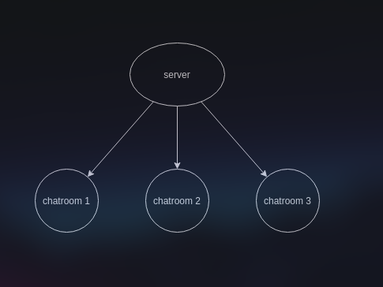
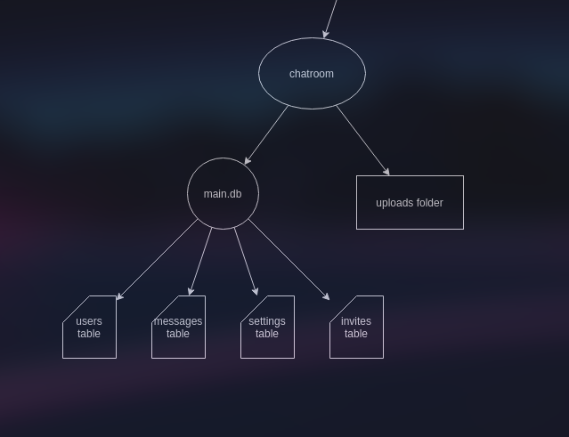

This is a long read, you may need some tea!  :)

# overview
An overview of how the server operates.

## server structure
Each server is responsible for handling multiple chatrooms. 

The server manages each chatroom individually. It doesnt store any centralized data but lets each chatroom manage their own database with their own users, channels, settings, etc. In effect each chatroom is its own segregated server-like system.

## chatroom structure

Each chatroom has a main database file and an uploads folder.

### uploads folder:
This folder stores all files that have been uploaded to the chatroom. Each file is stored with its name replaced with a UUID, this is the files ID number. Each file is also referenced in the `messages` table of `main.db`.

### main.db
Main db is an sqlite3 database file that stores all information the chatroom needs to function. The database is currently split into 4 tables:
 
* users table
* messages table
* invites table
* settings table
 

**Users table:**  
This table stores information on every user. The table is responsible for handling login related data as well as some user options.
* username:
   - The username of the user ¯\_(ツ)_/¯. 
   - The username should not really ever be displayed to other users, for that we have the nickname.
   - The username cannot be changed by the user  
* email:
  - The users email is used to verify the user.
  - The chatroom admin can turn change whether or not the chatroom requires email to register.
  - Asking for email helps moderation but also has a negative effect on privacy

    sql = "CREATE TABLE users ('username', 'email', 'nickname', 'password', 'cookies', 'colour', 'admin')"

docs are incomplete bc I had better things to do

